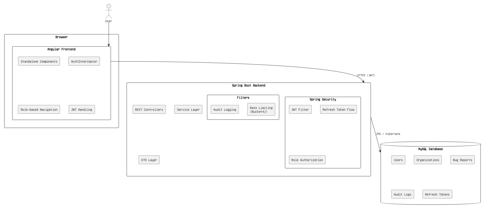
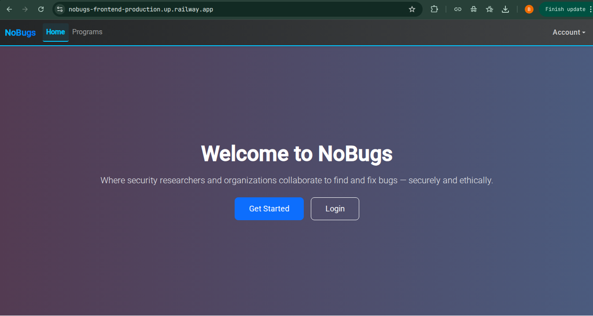
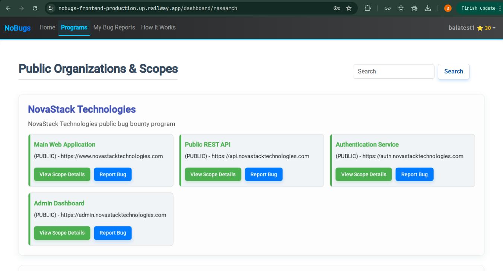
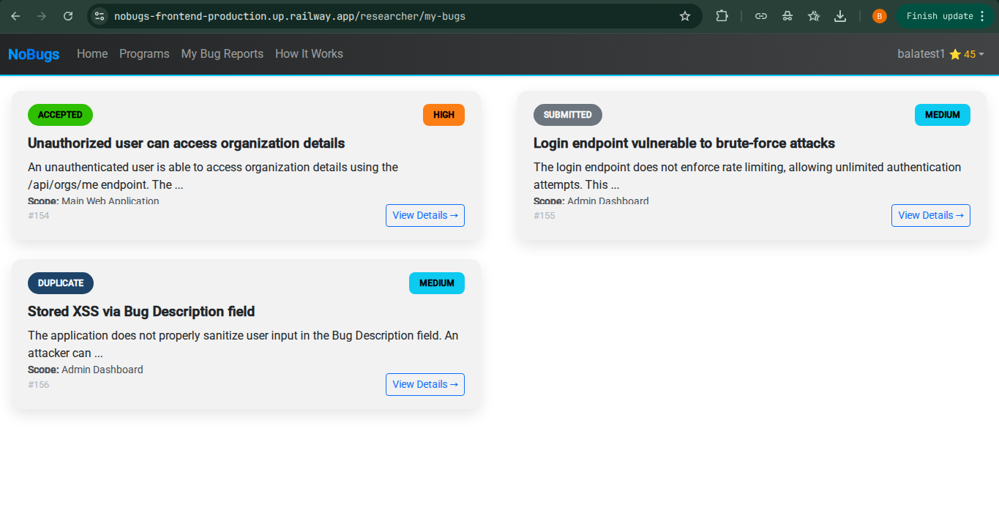
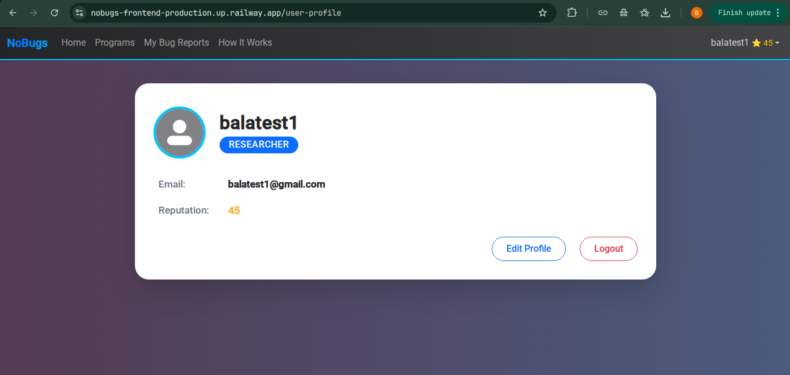
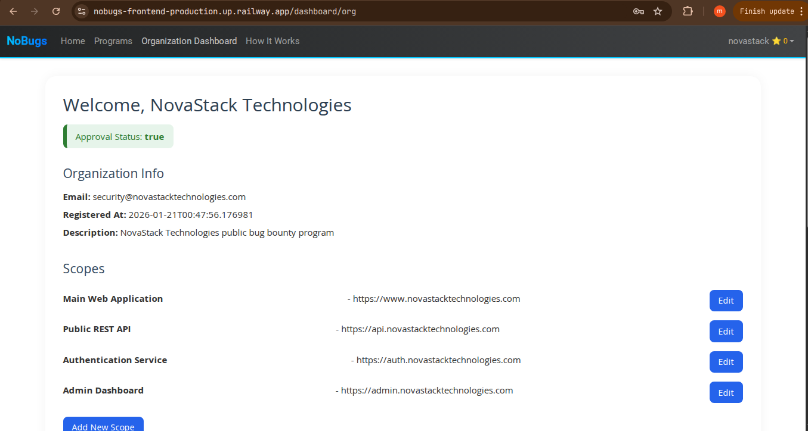
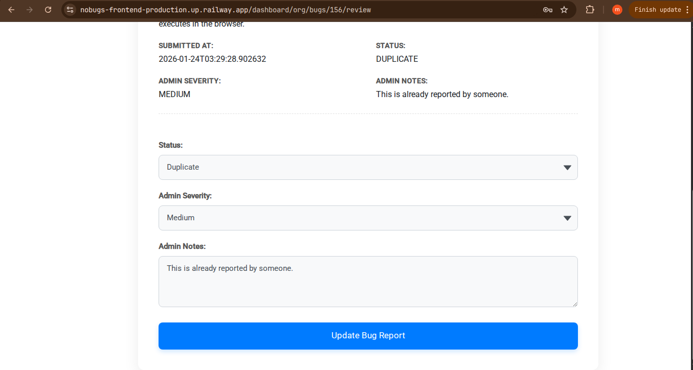
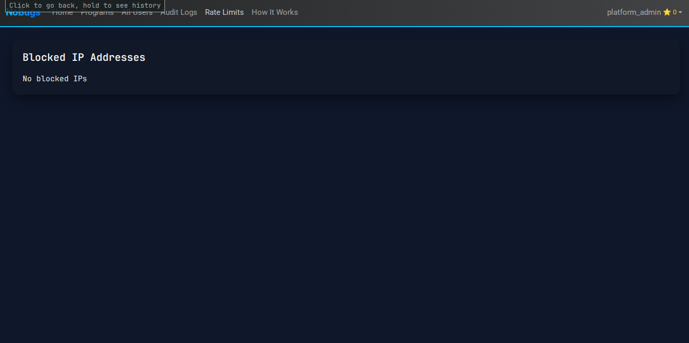

# NoBugs – Bug Bounty Platform

NoBugs is a **role-based bug bounty platform** designed to simulate how real-world vulnerability reporting systems work.  
It allows organizations to manage security programs, researchers to submit vulnerability reports, and administrators to monitor platform activity securely.

This project focuses on **backend security, authentication, authorization, and production-ready architecture**, rather than UI-heavy features.

---

## Live Demo

Frontend: https://nobugs-frontend-production.up.railway.app/  
Backend API: https://tranquil-charisma-production-4208.up.railway.app/

---

## Tech Stack

### Frontend
- Angular (Standalone Components)
- Angular Router
- JWT-based authentication
- AuthInterceptor
- Bootstrap
- Production build deployment

### Backend
- Spring Boot
- Spring Security
- JWT Authentication Filter
- Refresh Token mechanism
- Role-based access control
- Bucket4j Rate Limiting
- Audit Logging
- REST APIs
- Deployed on Railway

### Database
- MySQL
- JPA / Hibernate
- DTO-based data transfer

---

## Core Features

### Authentication & Security
- JWT-based **access tokens** (short-lived)
- **Refresh tokens** for secure session continuation
- Stateless authentication
- Secure logout with backend and frontend cleanup
- Token validation before rendering frontend state

### Authorization
- Role-based access control enforced at backend
- Roles:
  - ADMIN
  - ORGANIZATION
  - RESEARCHER
- Public and protected APIs explicitly separated
- JWT filter skips public endpoints correctly

### Rate Limiting
- Implemented using Bucket4j
- Applied at filter level
- Protects sensitive endpoints from abuse
- Admin visibility into rate-limit data

### Audit Logs
- Sensitive actions are logged
- Admin can view audit trails
- Enables traceability and monitoring

### Bug Reporting Workflow
- Researchers can submit vulnerability reports
- Organizations can review reported bugs
- Admins can monitor platform activity

---

## Architecture Overview

The application follows a standard full-stack architecture with a secure authentication and authorization model.

---

## Screenshots

### Guest Home Page
Public landing page accessible without authentication.

---

### Public Programs / Organizations
Organizations and programs can be viewed without login.

---

### Researcher – My Bug Reports
Authenticated researchers can view and manage their submitted bug reports.

---

### User Profile
Authenticated users can view their profile information.

---

### Organization Dashboard
Organizations can manage their program and review submitted bugs.

---

### Organization Bug Review
Organizations can review individual bug reports submitted by researchers.

---

### Admin – Rate Limits
Admin interface showing rate-limit information for protected endpoints.

---

### Admin – Audit Logs
Admin view of audit logs capturing critical platform actions, Paginated for reliability.

---

## API Security Model

### Public Endpoints
- Authentication APIs
- View organizations and programs

### Protected Endpoints
- Bug submission
- Dashboards
- User profile
- Organization management
- Admin operations

Access is enforced using Spring Security and JWT filters.

---

## Real-World Challenges Solved

- Prevented unauthorized UI access due to stale authentication state
- Fixed navbar rendering issues caused by Angular lifecycle timing
- Implemented secure logout even when backend fails
- Cleaned production logs and removed debug output
- Deployed and tested application in a production environment

---

## Why This Project Matters

This project demonstrates:
- Secure backend design
- JWT + Refresh Token implementation
- Role-based authorization
- Rate limiting and audit logging
- Real production debugging experience
- End-to-end deployment of a full-stack system

It is designed to reflect **real backend systems used in production**.

---

## Future Scope (Not Implemented)
- Email notifications
- Bug status workflow
- Advanced analytics

These were intentionally excluded to keep the project focused and interview-ready.

---

## Author

**Balakumaran S**

---

### Note
This project is intentionally scoped to demonstrate **strong backend fundamentals**, security awareness, and real-world problem solving suitable for backend or full-stack skills.
